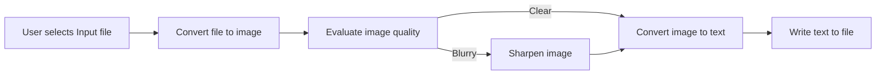

# Readable

## What is it?

A lightweight solution to convert PDF documents containing scanned documentation pages into text format. The app has a simple GUI implemented via the TKinter python library.

## Why?

I began this endeavor with the intention of solving an issue for someone dear to me: the challenge of searching through extensive PDF documents that had not been recognized as text. This obstacle was not only impeding their productivity but also proving to be a rather bothersome task.

## How

The inputfile (PDF) is converted to an image (.ppm) using image2pdf library.
Image quality evaluation, image sharpening and handling is done with opencv library.
Conversion to text is handled via pytesseract.
